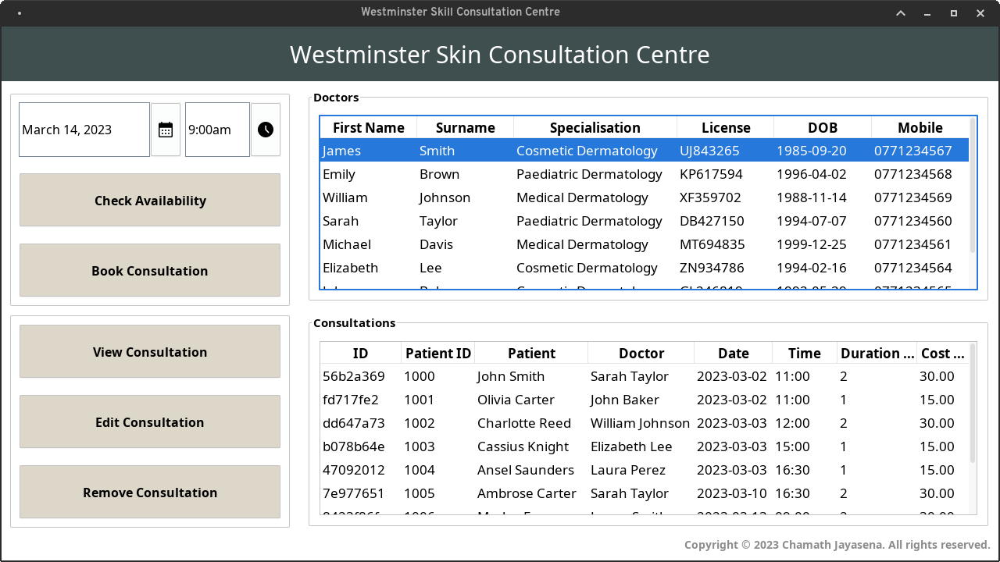

# Westminster Skin Consultation Centre
A Java Swing application for scheduling and managing consultations, featuring a console and a modern user-friendly GUI.

<p align="center">
  
</p>

## Features
- User-friendly interface for managing consultations
- Ability to add, remove, and sort doctors
- Ability to schedule and reschedule consultations
- Ability to save and view images per consultation
- 128-bit AES encryption
- Multithreading decryption for faster data decryption

## Dependencies
- FlatLaf: v2.3
- FlatLaf-IntelliJ-Themes: v1.1.2
- LGoodDatePicker: v11.2.1
- JUnit: v5.9.1

## Usage
1. Clone the repository: 

    ```
    git clone https://github.com/chamajay/consultation-management-system.git
    ```

2. Open the project in Intellij IDEA or other Java IDE.
3. Run the project.